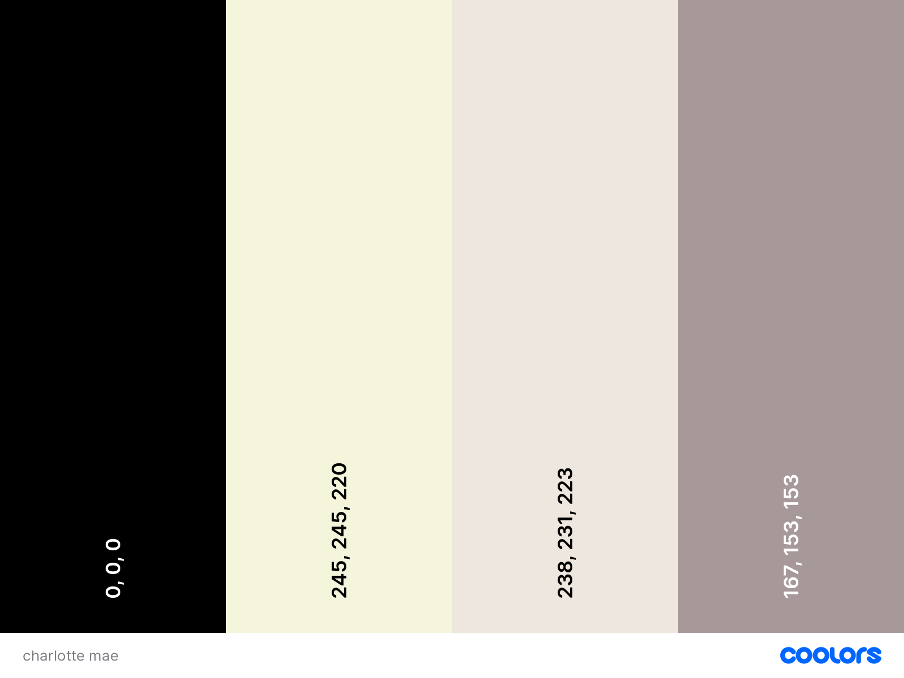

# CHARLOTTE MAE

charlotte mae's is a service based business , where charlotte mae provides therapy sessions for people dealing with
cycle of trauma, confusing emotions and feelings.

Visit the deployed website [here](https://)

## User experience

### Color Reference

* 

### Users stories

* As a user, I want to be able to know what the website's purpose is at the first glance
* As a user , I would like my needs to be relatable to the needs that website has provided
* As a user, i would like to know how the service provider of the website can address my needs
* As a user, i want to be able to contact the service provider and show intrest for their service

### Typography

* 'castoro' is the font used for the body of the site with serif used as a fallback.
* 'castoro Titling' is the font used for the logo, header sections and footer sections

### Imagery

The images utilized in the website, are choosen in a way that gives a calming feeling to the potential user profile. 

* the main opening image consists of a women who is peacefully expressing her feelings through her art in a calm nature setting
* the image in the first section of the home page shows the contrast from the main picture by conveying disturbance 
* the image in the second section of the home page is a picture of a smiling saviour(charlotte mae), who provides service to the user profile of the site
* the image in the third section of the home page visually represents to book a discovery call
* the image in the about section is again a picture of the service provider(charlotte mae) so the user gets to familarize with her

### Holistic feel
The crucial objective of the wesbsite is to make its service attractive to the user profile by addressing relatable needs of the service and show it in a more elegant way by providing only required information in a very soothing and peaceful way through selective colors and pictures.

## Features

* Made it Responsive design for all the pages and for all device sizes.
* In the home page, It has a navigation menu in the header, a learn more button in the cover text, which leads to about section, the needs of the userprofile, about the service provider and a section that has a button to book for a call, which further leads to contact page.
* In the about page, it provides further information of the service provider and their approach to the problem.
* In the contact page, a sign up form is provided, to book for the service .
* In the footer section, the logo of the website and facebook and google maps icons are provided.

## Technologies Used

### Languages Used

* [HTML5](https://en.wikipedia.org/wiki/HTML5)
* [CSS3](https://en.wikipedia.org/wiki/CSS)

### Frameworks, Libraries and Programs Used

* [Google Fonts](https://fonts.google.com/)
    - Google Fonts was used to import the fonts Castoro Titling and castor to the style.css file.

* [Font Awesome](https://fontawesome.com/)
     - Font Awesome was used in the footer section throughout all pages to add icons

* [Pexels](https://www.pexels.com/es-es/)
    - Pexels was used for all the images of the site.

* [GitHub](https://github.com/)
     - GitHub was used to store the project after pushing.

* [GitPod](https://gitpod.io/)
     - GitPod was used for writing code, committing, and then pushing to GitHub.

* [Am I Responsive?](http://ami.responsivedesign.is/#)
    - Am I Responsive was used to check the responsivness and for the image to be attached in the readme.md file

* [Chrome DevTools](https://developer.chrome.com/docs/devtools/)
    - Chrome DevTools was used during development process for code review 

* [W3C Markup Validator](https://validator.w3.org/)
    - W3C Markup Validator was used to validate the HTML code.

* [W3C CSS Validator](https://jigsaw.w3.org/css-validator/)
    - W3C CSS Validator was used to validate the CSS code.

# Testing
## Code Validation

At the completion , I used the following websites to check my code for syntax errors:
*  HTML - https://validator.w3.org/
*  CSS - https://jigsaw.w3.org/css-validator/

## Further Testing
### Personal Testing
Through devices that I have at home/readily available to me, I was able to continuously test on:
* For larger screens-1444px
* For large screens- 1250px to 1443px
* For normal screens- 1249px to 1025px
* For laptop screens- 1024px to 951px
* For medium screen - 950px to 769px
* For tablet screen - 768px to 601px
* For mobile screen - 600px to 481px
* For small mobile screen- 480px to 320px

### Accesibility

* Lighthouse Devtool from Google Chrome used for testing.
* Lighthouse testing:

 

    
### Unfixed bugs

* No unfixed bugs remaining in the website.

## Deployment

### GitHub-deploy

* This are the steps I followed to deploy my project from its GitHub repository:

1. Open [GitHub Repository](https://github.com/) login and find the project repository.
2. At the top of the repository on the right corner click on settings button.
3. Go to Pages section inside settings.
4. Go to Branch tag and find a dropdown menu where you can choose between none or main.
5. Select main, after a short waiting GitHub will generate your website link.

## Credits

### Content

* All the content was written by Jayadeep Ravuri.

### Media
* All the images included in the site, were downloaded from the free picture website, Pexels

### Code

* [W3Schools](https://www.w3schools.com/) were visited for better understanding of coding elements syntax.

## Acknowledgements

* Code Institute and their tutor assistance along with the community in slack for 
all the support in this project
* Antonio, my mentor for his guidance and his time.
